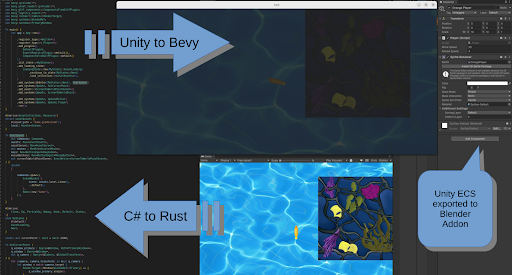
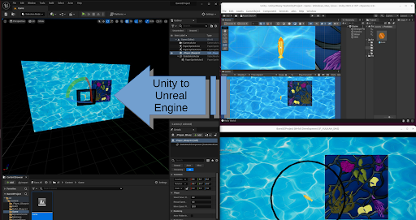

I am running out of energy for this project, and it is slowing down. Also, please feel free to contribute!

# Name
Unity2Many

# Description
A set of tools for game and software development

Three tools can be used (as well as an addon for Blender); UnityToUnreaal, UnityToBevy, and KritaToBlender.

UnityToUnreal and UnityToBevy translates a Unity project to an Unreal or bevy project respectively. KritaToBlender is a tool that can be run in Krita to export the current document to Blender so that the content can be animated.

MakeBlenderPlugin.py (part of the BlenderPlugin tool) provides an interface in Blender for using the tools of this project (KritaToBlender can't be used from BlenderPlugin yet). It can also export from Blender to Unity, Unreal, and bevy. Additionally, BlenderPlugin can attach Unity C# scripts (Blender text blocks) to Blender objects and run the scripts.

# Installation
Inside the terminal program on your computer, type or copy and paste 'cd ~' and press the Enter key to change directory to your account folder. Then run (type or copy and paste the following and then press Enter) 'git clone https://github.com/OpenSourceJesus/Unity2Many --depth=1' to download the files and folders of this project to the current folder (your account folder). Note that these installation steps except for the first step require internet connection.

Then run 'sudo apt -y install make' to install make.

Next, run 'make install_UnityToBevy' to install the required parts to translate a Unity project to a bevy project. To install the parts for any of the other tools like BlenderPlugin, UnityToUnreal, or KritaToBlender, run 'make install_' and then add the name of the tool to run as one command.

## Requirements
Currently, only Linux operating systems are supported. Testing has only been done on Ubuntu 23.10 and Ubuntu 24.04.

# Usage
In BlenderPlugin, the export buttons and export paths are in the World Properties. The dropdowns for attaching and detaching scripts are in the Object Properties. All other interface items are found in the Text Editor after you make a text block. Having the 'Unity project import path' empty in the World Properties will export from Blender rather than exporting from the Unity project at the 'Unity project import path'.

For using UnityToBevy without the BlenderPlugin, in the terminal run 'python3 UnityTobevy.py input={path to Unity project to translate from} output={path to bevy project to translate to}'. Replace '{', '}', and what is in between them with the path to the Unity project and the path to the bevy project respectively. You can also add ' exclude={path or part of a path in the Unity project to exclude from the translation}' in the terminal command to not translate any files in the Unity project that contain what is in between the '{' and '}'. UnityToUnreal uses the same rules.

Currently, to use the KritaToBlender tool run the Krita program and then mouse over the 'Tools' dropdown at the top of Krita. Mouse over 'Scripts' and then click on 'Scripter'. Then, mouse over 'File' and click on 'Open'. Navigate to MakeKritaBlenderFile.py in the file browser that automatically opens and then double-click on that file in this file browser. Finally, click on the play button circled in this image: to run the script.

Also, I made this project for testing as an input Unity project for translation: 'https://github.com/OpenSourceJesus/Unity2Many-TestUnityProject'.

## Notes
BlenderPlugin's interface only appears the second time (and the times after that) you run BlenderPlugin.

If you want to want to run BlenderPlugin in a specific blender file then in the terminal run 'blender {path to your Blender file} --python MakeBlenderPlugin.py'. If you want to run BlenderPlugin with a specific Blender executable, then replace 'blender' at the start of the previous terminal command with the path to the Blender executable. You can also leave '{path to your Blender file}' empty to start BlenderPlugin without a Blender file.

In BlenderPlugin, running a C# script won't work if you attach the script to object(s) after checking the 'Run C# Script' checkbox in Blender's Text Editor. It will work if you attach the script to object(s) and then check the checkbox. The dropdowns for attaching and detaching scripts will appear after a text block has been made in the Text Editor and the 3D Viewport visible. Sometimes the attach script dropdown will only appear once you mouse over the object name in Object Properties.

Each script needs to be have the same name as the MonoBehaviour class contained within it in BlenderPlugin.

Some comments are treated as code in the output of translations (not desired behvaior).

In UnityToBevy, when float variables in C# scripts are declared they need to be set to a value that contains a decimal and has an 'f' at the end for proper translation.

Currently, there isn't a way to have prefabs when exporting from Blender to Unity.

Currently, exporting mesh objects from Blender won't work properly unless a version of Unity is installed.

This project's translation tools rely on my forks of CSharpToPython (https://github.com/OpenSourceJesus/CSharpToPython) and py2many (https://github.com/OpenSourceJesus/py2many). Additionally, UnityToBevy relies on my fork of Blender_bevy_components_workflow (https://github.com/OpenSourceJesus/Blender_bevy_components_workflow). Running the 'make install_' commands will install the corresponding forks.

# Support
Use this webpage to know what should be done in the future of this project (and what has been done) and feel free to add issues (entries) to it: 'https://github.com/OpenSourceJesus/Unity2Many/issues'. Also, my email is 'gileadcosman@gmail.com', and I would love to respond to any questions or comments you have.

# Roadmap
The tools UnityToStride, UnityToGodot, and UnityToPygame have been started and will hopefully be done eventually. Also, adding spawning and prefab support to the translation tools will hopefully be done eventually. Additionally, support for using KritaToBlender, UnityToStride, UnityToGodot, and UnityToPygame should be added to BlenderPlugin eventually. For viewing or contributing to the list of what should get be done in the future of this project (and what has been done), use this webpage: 'https://github.com/OpenSourceJesus/Unity2Many/issues'.

# Contributing
I will accept all contributions.

# Authors and acknowledgment
So far only I, Gilead Cosman, have worked on this project.

# License
MIT License

Copyright 2024 Gilead Cosman

Permission is hereby granted, free of charge, to any person obtaining a copy of this software and associated documentation files (the “Software”), to deal in the Software without restriction, including without limitation the rights to use, copy, modify, merge, publish, distribute, sublicense, and/or sell copies of the Software, and to permit persons to whom the Software is furnished to do so, subject to the following conditions:

The above copyright notice and this permission notice shall be included in all copies or substantial portions of the Software.

THE SOFTWARE IS PROVIDED “AS IS”, WITHOUT WARRANTY OF ANY KIND, EXPRESS OR IMPLIED, INCLUDING BUT NOT LIMITED TO THE WARRANTIES OF MERCHANTABILITY, FITNESS FOR A PARTICULAR PURPOSE AND NONINFRINGEMENT. IN NO EVENT SHALL THE AUTHORS OR COPYRIGHT HOLDERS BE LIABLE FOR ANY CLAIM, DAMAGES OR OTHER LIABILITY, WHETHER IN AN ACTION OF CONTRACT, TORT OR OTHERWISE, ARISING FROM, OUT OF OR IN CONNECTION WITH THE SOFTWARE OR THE USE OR OTHER DEALINGS IN THE SOFTWARE.